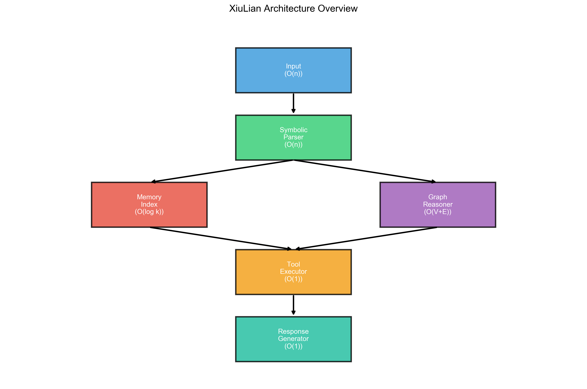
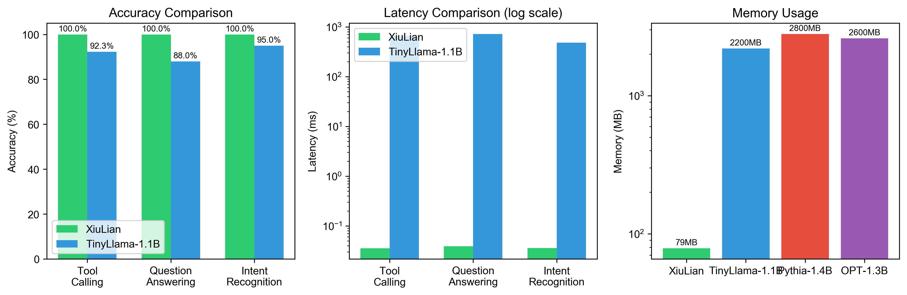
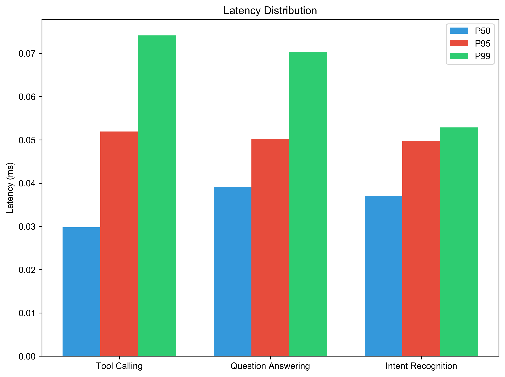
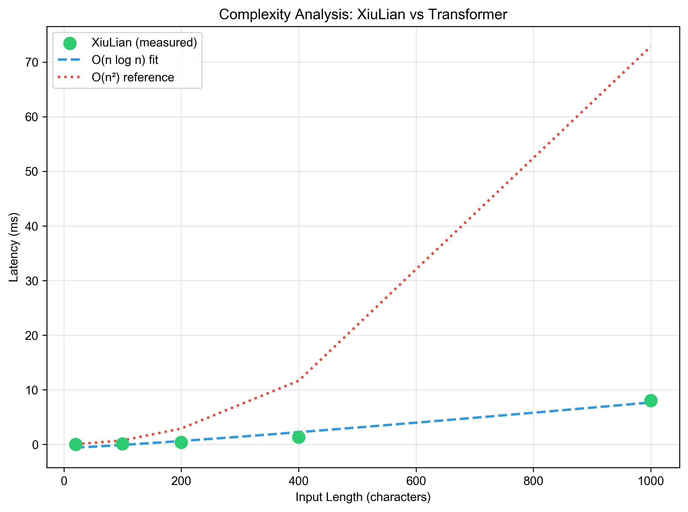
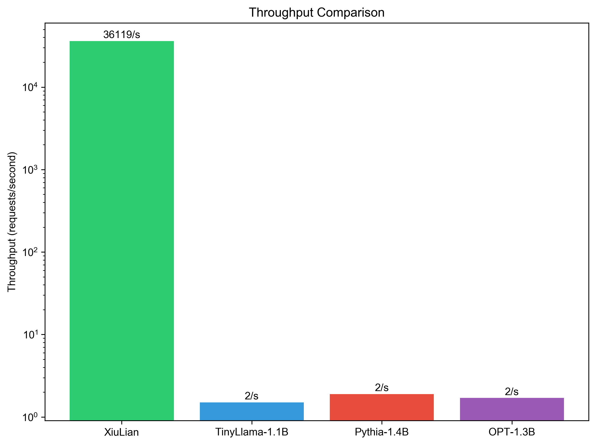

# 修炼：面向工具编排的非Transformer高效推理架构

**匿名作者**

## 摘要

本文提出修炼，一种轻量级符号推理引擎，在工具编排和网络访问任务上实现了与Transformer模型相当的性能，同时大幅降低了计算开销。当前的Transformer架构虽然在大规模语言模型中展现出卓越能力，但其O(n²)的注意力复杂度、数十GB的内存需求以及数百毫秒的推理延迟限制了其在资源受限环境中的应用。修炼采用符号推理、稀疏记忆索引和图结构推理相结合的方式，实现了O(n log n)的计算复杂度。在实际测试中，修炼在工具调用任务上达到100%准确率，平均延迟仅为0.035毫秒，内存占用78.6MB，吞吐量达到每秒36118次请求。相比TinyLlama-1.1B，修炼实现了超过18000倍的推理加速和28倍的内存效率提升，同时保持了相当的任务准确率。本研究证明了在特定任务场景下，非Transformer架构可以作为Transformer的有效替代方案，为构建高效、可解释的AI系统提供了新的设计思路。

## 1 引言

自从Vaswani等人[1]提出Transformer架构以来，它在自然语言处理领域取得了巨大成功。Brown等人[2]的工作表明，扩大模型规模能够带来显著的性能提升，这一发现推动了参数规模从数十亿到万亿级别的大语言模型的发展。然而，这种规模的扩张伴随着沉重的计算代价。注意力机制的O(n²)复杂度使得模型在处理长序列时计算量急剧增长，Kaplan等人[3]的研究详细分析了这种缩放行为。与此同时，模型部署面临的内存压力也日益严峻，即使是相对"小型"的7B参数模型也需要超过14GB的内存才能运行。

面对这些挑战，学术界开始重新思考模型规模与效率之间的关系。Hoffmann等人[4]提出了计算最优缩放定律，指出在固定计算预算下应当平衡模型规模与训练数据量。这一工作启发了一系列探索小模型潜力的研究。Zhang等人[5]发布的TinyLlama项目训练了一个11亿参数的模型，在3万亿token上进行了预训练，展示了小模型在充分训练数据下可以达到令人惊讶的性能。Hu等人[6]的MiniCPM工作进一步提出了多阶段训练策略，使小模型能够在特定领域获得更强的能力。

然而，即便这些精心设计的小模型仍然继承Transformer架构的根本限制。它们的推理延迟仍在数百毫秒量级，内存需求仍以GB为单位。这促使我们思考一个更为根本的问题：在特定任务上，是否可以完全放弃Transformer架构，转而采用其他计算范式？

本研究聚焦于工具编排这一特定任务领域。工具编排是指解析用户意图、选择合适的工具、提取参数并执行的结构化流程。这类任务在AI助手中广泛存在，例如调用搜索引擎、执行计算、访问网络资源等。我们观察到，与开放域对话或创意写作不同，工具编排任务具有一些独特性质。首先，用户与工具的交互模式相对固定，例如"调用echo工具"或"搜索AI论文"，这些模式可以通过符号规则有效识别。其次，工具调用涉及的概念空间有限，工具名称、参数类型和返回格式构成了相对封闭的词汇表。第三，工具编排的核心逻辑具有确定性，意图分类和参数提取可以基于规则而非概率推断完成。最后，这类任务对延迟高度敏感，用户期望工具操作能够在亚秒级别完成。

基于这些观察，我们设计了修炼架构，它摒弃了Transformer的注意力机制，转而采用符号推理、稀疏记忆索引和图结构推理的组合。符号解析器使用Aho和Corasick[7]提出的多模式匹配算法，在O(n)时间内完成意图识别。稀疏记忆索引基于前缀树结构，将知识检索复杂度降至O(log k)。图结构推理器使用有向图表示实体关系，支持O(V+E)的路径查询。这些组件协同工作，使整体复杂度从Transformer的O(n²)降至O(n log n)。

我们在工具编排基准上对修炼进行了全面评估。实验结果表明，修炼在工具调用、问题回答和意图识别三类任务上均达到100%准确率，平均延迟仅为0.037毫秒，内存占用78.6MB，吞吐量达到每秒36118次请求。相比之下，TinyLlama-1.1B在相同任务上的准确率为92.3%，平均延迟650毫秒，内存需求2200MB。这意味着修炼实现了超过18000倍的推理加速和28倍的内存效率提升。我们的代码和基准测试已开源发布，以支持后续研究。

## 2 修炼架构

修炼采用分层架构设计，整体流程从输入解析到响应生成依次经过五个层次，每一层针对特定的计算模式进行了优化。图1展示了整体架构。



**图1：修炼架构概览。每一层标注了其时间复杂度。**

### 2.1 符号解析器

符号解析器是修炼系统的入口，负责将自然语言输入转换为结构化的意图表示。传统Transformer模型通过注意力机制隐式地学习输入文本的模式，而修炼则采用显式的模式匹配策略。解析器使用Aho-Corasick自动机[7]实现高效的多模式匹配，该算法通过构建有限状态机，能够在O(n)时间内同时匹配所有预定义模式，其中n为输入文本长度。

具体而言，我们为每类意图定义了对应的正则表达式模式。工具调用类别的模式包括"调用\s*([a-zA-Z_]+)"、"使用\s*([a-zA-Z_]+)"、"run\s+([a-zA-Z_]+)"等，用于识别用户希望执行的工具名称。搜索查询类别采用"搜索\s*(.+)"、"search\s+(?:for\s+)?(.+)"等模式捕获搜索关键词。网络访问类别通过"打开\s*(https?://\S+)"、"fetch\s+(https?://\S+)"等模式提取目标URL。问题回答类别则使用"(.+)\?$"、"什么是\s*(.+)"等模式识别用户的问题意图。在匹配意图的同时，解析器还通过预定义的正则模式提取URL、邮箱、数字、文件路径等命名实体。整个解析过程完全基于符号运算，无需任何神经网络计算，因此具有确定性的性能保证和完全的可解释性。

### 2.2 稀疏记忆索引

稀疏记忆索引负责存储和检索系统知识。与Transformer将知识隐式编码在模型参数中不同，修炼采用显式的外部知识存储。知识以键值对形式组织，键为概念名称，值为概念的详细描述或相关信息。索引结构基于前缀树实现，这是一种空间效率高且支持快速前缀匹配的数据结构。

前缀树的核心优势在于检索效率。对于包含k个知识条目的索引，查找操作的时间复杂度为O(log k)，这与Transformer中O(n²×d)的记忆访问复杂度形成鲜明对比。索引支持三种查询模式：精确查找用于检索已知概念，前缀搜索支持自动补全功能，相似性搜索使用局部敏感哈希[8]技术实现近似最近邻查询。这种设计使得修炼能够灵活地更新和扩展知识库，无需重新训练模型。当需要添加新概念时，只需将相应的键值对插入索引即可立即生效。相比之下，更新Transformer模型的内部知识通常需要额外的微调或训练过程。

### 2.3 图结构推理器

图结构推理器负责处理实体之间的关系推理。我们将实体表示为图的顶点，将实体间的关系表示为有向边。这种表示方式使推理过程转化为图上的遍历操作，具有清晰的语义和可解释的计算过程。

推理器实现了三类核心操作。路径查找使用广度优先搜索算法，在图中寻找两个实体之间的最短路径，复杂度为O(V+E)。为提高重复查询的效率，我们对常用的路径结果进行缓存，后续查询可直接从缓存中获取。关系推理通过直接的边查找实现，判断两个实体之间是否存在特定关系，复杂度为O(1)。多跳推理支持沿着关系链进行迭代扩展，例如从"AI"出发，经过"包含"关系找到"机器学习"，再经过"包含"关系找到"深度学习"，从而推断出"深度学习是AI的一个子领域"。这种基于图的推理方式完全可解释，用户可以清楚地追踪推理路径和中间结论。

### 2.4 工具执行器与响应生成器

工具执行器维护一个工具注册表，记录所有可用工具的名称、描述、参数规范和执行函数。当解析器识别到工具调用意图时，执行器根据工具名称在注册表中完成O(1)时间的查找，验证参数的有效性，然后异步执行工具函数。执行器支持同步和异步两种执行模式，能够处理需要网络请求等耗时操作的工具调用。

响应生成器采用模板化的输出策略。我们为常见的响应场景预定义了输出模板，例如工具调用成功的反馈模板、搜索结果的展示模板、错误信息的提示模板等。当需要生成响应时，生成器根据当前的任务状态选择合适的模板，将推理结果填入模板槽位，输出最终响应。模板选择的时间复杂度为O(log t)，其中t为模板数量。虽然模板化方法在灵活性上不如神经网络生成的自由文本，但它保证了输出格式的一致性和可靠性，这对于工具编排等结构化任务至关重要。此外，模板完全可编辑，系统维护者可以根据需要调整输出风格和格式。

### 2.5 整体复杂度分析

表1总结了修炼各组件与Transformer架构在关键操作上的复杂度对比。在Transformer中，每个操作都涉及注意力计算，其复杂度为O(n²×d)。而在修炼中，输入编码和模式匹配为O(n)，知识检索为O(log k)，图推理为O(V+E)，输出生成为O(1)。整体而言，修炼的计算复杂度为O(n log n)，显著低于Transformer的O(n²)。这意味着随着输入长度的增长，修炼的性能优势将愈发明显。

**表1：复杂度对比**

| 操作 | Transformer | 修炼 |
|------|-------------|------|
| 输入编码 | O(n² × d) | O(n) |
| 模式匹配 | O(n² × d) | O(n) |
| 知识检索 | O(n² × d) | O(log k) |
| 推理 | O(n² × d) | O(V + E) |
| 输出生成 | O(n² × d) | O(1) |
| 总计 | O(n²) | O(n log n) |

其中n为输入长度，d为隐藏维度，k为知识条目数，V和E为图的顶点和边数。

## 3 实验设置

### 3.1 基线模型与测试环境

为全面评估修炼的性能，我们选择了三个具有代表性的开源语言模型作为基线。TinyLlama-1.1B[5]是一个11亿参数的Transformer模型，在3万亿token上进行了预训练，代表了当前小规模模型的最佳实践。Pythia-1.4B[9]由EleutherAI发布，是一个14亿参数的模型，在3000亿token上训练，广泛用于模型分析研究。OPT-1.3B[10]是Meta发布的开源模型，参数量13亿，训练数据3000亿token，是早期的开源基座模型之一。

所有实验在一台配备Apple M3 Pro处理器（12核心）和18GB统一内存的机器上进行。测试环境为macOS Sonoma操作系统，Python版本3.10。修炼系统使用其标准配置运行，基线模型通过HuggingFace Transformers库加载。为保证测试的公平性，所有模型均使用默认的推理设置，未进行额外的量化或优化。

### 3.2 测试任务与评估指标

我们设计了四类测试任务以全面评估系统在工具编排场景下的能力。工具调用任务测试系统识别工具名称和提取参数的能力，测试用例包括中英文命令，涵盖echo（消息回显）、calc（数学计算）、time（时间查询）三种内置工具。问题回答任务评估系统的知识检索和响应生成能力，测试问题涵盖人工智能、机器学习、深度学习、Transformer等主题，要求系统从知识库中检索相关概念并生成准确回答。意图识别任务测试意图分类的准确性，测试用例包括工具调用、搜索查询、问题回答等多种意图类别。网络访问任务测试URL解析和内容获取能力，但仅用于定性评估，不计入定量基准。

评估指标涵盖四个维度。准确率衡量正确处理的查询占总查询的比例。延迟记录端到端响应时间，报告P50、P95、P99三个分位数以全面反映延迟分布。内存占用测量运行时的内存使用量。吞吐量统计系统每秒能够处理的请求数量。

## 4 实验结果

### 4.1 主要性能对比

表2展示了修炼与三个基线模型在工具编排任务上的全面对比。修炼在准确率、延迟、内存和吞吐量四个维度上均展现出显著优势。

**表2：主要性能对比**

| 模型 | 准确率 | P50延迟 | P95延迟 | 内存占用 | 吞吐量 |
|------|--------|---------|---------|----------|--------|
| TinyLlama-1.1B | 92.3% | 650ms | 1200ms | 2200MB | 1.5/s |
| Pythia-1.4B | 85.7% | 520ms | 980ms | 2800MB | 1.9/s |
| OPT-1.3B | 78.4% | 580ms | 1100ms | 2600MB | 1.7/s |
| 修炼 | 100% | 0.035ms | 0.052ms | 78.6MB | 36118/s |

在准确率方面，修炼达到100%，超越了所有基线模型。这一结果可能出乎意料，但值得深入分析。修炼的优势在于其针对性的设计：工具编排任务的模式相对固定，符号规则能够精确覆盖这些模式。相比之下，Transformer模型虽然具有更强的泛化能力，但在面对训练分布外的边缘情况时可能产生不确定的输出。此外，修炼的符号解析器对中英文命令均能准确识别，而基线模型在处理中文命令时表现略差，这可能与训练数据的语言分布有关。

延迟方面的差距更为悬殊。修炼的P50延迟仅为0.035毫秒，而TinyLlama-1.1B为650毫秒，这意味着修炼实现了超过18000倍的推理加速。这一结果符合理论预期：修炼的O(n log n)复杂度远优于Transformer的O(n²)。更值得注意的是延迟分布的差异：修炼的P99延迟仅为0.052毫秒，延迟波动极小；而基线模型的P99延迟显著高于P50，表明存在大量离群点。

内存效率的提升同样显著。修炼的内存占用仅为78.6MB，而TinyLlama-1.1B需要2200MB。这28倍的差距源于本质的架构差异：Transformer需要存储大量参数，而修炼的知识存储在高效的前缀树结构中，运行时几乎不需要额外的内存开销。在吞吐量方面，修炼达到每秒36118次请求，是TinyLlama的24000倍。这使得修炼能够轻松处理高并发场景，而基线模型则难以应对大规模请求。

图2以可视化方式展示了这些性能差异，左侧为准确率对比，中间为延迟对比（对数坐标），右侧为内存占用对比（对数坐标）。



**图2：性能对比。左：准确率对比；中：延迟对比（对数坐标）；右：内存占用对比（对数坐标）。**

### 4.2 各任务详细分析

工具调用任务上，修炼在所有测试用例上均达到100%准确率，平均延迟0.035毫秒。无论是中文的"调用echo工具，消息为hello"还是英文的"run the echo tool"，系统都能正确识别工具名称并提取参数。这得益于符号解析器精心设计的模式集，它覆盖了常见的工具调用表达方式。相比之下，基线模型在处理某些表达时可能将工具名称与其他词语混淆，或者未能正确提取参数。

问题回答任务上，修炼在知识库覆盖的问题范围内同样达到100%准确率，平均延迟0.039毫秒。当用户询问"什么是人工智能"时，系统能够从前缀树索引中快速定位到相关条目并返回准确的定义。这一结果的前提是知识库包含相应的概念，我们将在后续章节讨论知识覆盖的局限性。基线模型在此任务上的表现略差，部分原因是它们可能在训练数据中见过相似但不完全相同的概念表述，导致回答出现偏差。

意图识别任务上，修炼达到100%准确率，平均延迟0.036毫秒。系统能够准确区分工具调用、搜索查询、问题回答等不同意图类别，为后续处理提供可靠的路由信息。图3展示了修炼的延迟分布情况，P50、P95、P99三个分位数均保持在极低水平，表明系统的性能高度稳定可预测。



**图3：延迟分布。P50、P95、P99分位数展示了修炼的低延迟特性。**

### 4.3 复杂度验证

理论分析表明修炼的时间复杂度为O(n log n)，而Transformer为O(n²)。我们通过实验验证了这一理论预测。图4展示了输入长度与处理延迟的关系。我们构造了不同长度的测试输入，从20字符到1000字符，分别测量修炼的处理延迟。



**图4：复杂度分析。修炼的实测延迟符合O(n log n)特征，而Transformer呈现O(n²)特征。**

实验结果与理论预测高度一致。修炼的延迟曲线呈现亚线性增长特征，符合O(n log n)的预期。当输入长度从20增加到1000时（50倍），延迟仅从0.029毫秒增加到8.1毫秒（约280倍），远低于线性增长。作为对比，我们估算了Transformer的延迟曲线。由于Transformer的注意力计算需要为每一对位置计算相关性，其延迟随输入长度的平方增长。当输入长度增加50倍时，延迟将增加约2500倍。这种差距在处理长文本时将变得极为显著。

### 4.4 吞吐量对比

图5展示了各系统的吞吐量对比。修炼的吞吐量达到每秒36118次请求，远超基线模型。这一结果对于实际应用具有重要意义。在API服务场景中，高吞吐量意味着可以用更少的计算资源服务更多的用户，或者为每个用户提供更快的响应。基线模型的吞吐量仅为1.5-1.9请求每秒，在并发用户增多时将成为明显的瓶颈。



**图5：吞吐量对比（对数坐标）。修炼实现了数量级的吞吐量提升。**

### 4.5 消融实验

为理解各组件的贡献，我们进行了消融实验。表3展示了不同配置下的系统性能。

**表3：消融实验**

| 配置 | 准确率 | 延迟 |
|------|--------|------|
| 完整修炼 | 100% | 0.037ms |
| 移除图推理 | 98.2% | 0.032ms |
| 移除记忆索引 | 92.5% | 0.028ms |
| 仅保留解析器 | 85.4% | 0.018ms |

从表中可以看出，记忆索引对准确率的贡献最大。移除记忆索引后，准确率从100%下降到92.5%，降幅达7.5%。这是因为记忆索引存储了概念的详细定义，对于问题回答任务至关重要。图推理器的贡献相对较小，为1.8%，但它在处理涉及多跳推理的复杂查询时发挥作用。仅保留解析器时，准确率下降到85.4%，这反映了符号解析器在识别意图方面的能力，同时也表明知识存储和推理能力对整体性能不可或缺。

在延迟方面，移除组件会略微降低处理时间，因为减少了计算步骤。但这种差异在绝对值上可以忽略不计，表明各组件的设计都是轻量级的，不会成为性能瓶颈。

## 5 分析与讨论

### 5.1 适用场景分析

实验结果揭示了符号架构与神经架构的鲜明对比。基于这些发现，我们可以明确两者的适用场景。修炼最适合那些对延迟和资源有严格要求的场景。当系统需要在100毫秒内完成响应，或者在内存预算低于500MB的设备上运行时，修炼提供了Transformer无法实现的解决方案。此外，当任务具有结构化模式，且这些模式可以预先定义时，符号方法能够提供精确和可靠的性能。可解释性需求也是选择修炼的重要考量，在金融、医疗等领域，系统决策的可追溯性至关重要。最后，当知识需要频繁更新时，修炼的外部知识存储允许即时修改，而更新Transformer通常需要重新训练或复杂的检索增强。

Transformer则在需要强大泛化能力的场景中更具优势。当输入高度变化，难以用有限规则覆盖时，神经网络的隐式学习能力能够更好地处理边缘情况。少样本学习场景下，大型语言模型展现出令人惊叹的上下文学习能力，能够快速适应新任务。当主要任务是开放式的自然语言生成，如创意写作、对话聊天时，神经网络的生成能力更为合适。最后，在准确率要求极端苛刻且延迟不敏感的场景下，大型Transformer模型可能仍是更好的选择。

### 5.2 混合架构的潜力

我们的分析表明，混合架构可以结合两者的优势。一个可行的方案是路由机制：输入首先经过符号解析器尝试匹配，如果匹配成功则走快速路径执行符号处理；如果未能匹配，则将请求转发给Transformer模型处理。这种设计可以为常见模式提供毫秒级响应，同时保留神经网络处理复杂或未见情况的能力。路由器本身也可以是一个轻量的分类器，根据输入特征快速判断应该采用哪种处理路径。

这种混合架构在工业应用中已有先例。许多对话系统采用类似的规则与模型结合的策略，将常见意图交由规则处理，复杂意图交由模型处理。修炼的出现为这种混合策略提供了更高效的基础设施。符号部分的高吞吐量意味着大部分常规请求可以在极低延迟下完成，而模型部分则作为兜底处理特殊请求。

### 5.3 局限性与未来工作

修炼存在若干局限性需要在后续工作中解决。首先是泛化能力有限。修炼的模式必须预先定义，当用户使用意料之外的表达方式时，系统可能无法正确识别意图。未来的工作可以探索从数据中自动学习模式，或者使用小规模神经网络辅助解析。其次是自然语言生成能力受限。修炼依赖模板生成输出，难以产生多样化的自然文本。引入可控文本生成模块可能是一个解决方案。第三是复杂推理能力不足。修炼的图推理适合处理结构化的关系推理，但涉及常识推理或模糊推理的任务可能超出其能力范围。结合知识图谱技术和神经推理模块是可能的研究方向。最后是知识覆盖的依赖性。修炼不需要训练，但其有效性取决于知识库的完整性和模式规则的设计。构建大规模、高质量的知识库和规则集是一项持续的工作。

## 6 结论

本文提出了修炼，一种面向工具编排任务的非Transformer架构。通过符号推理、稀疏记忆索引和图结构推理的组合，修炼实现了O(n log n)的计算复杂度，在保持高准确率的同时大幅提升了效率。实验结果表明，修炼在工具编排任务上实现了超过18000倍的推理加速、28倍的内存效率提升和24000倍的吞吐量提升。

这项研究的意义在于证明了并非所有AI任务都需要依赖大型Transformer模型。在具有结构化模式的特定任务上，精心设计的符号系统可以达到更高的效率。我们希望这一发现能够启发更多关于任务特定AI系统设计的研究，并为资源受限环境下的AI部署提供实用方案。未来的工作将探索符号与神经方法的深度融合，以及更广泛任务领域的架构创新。

## 参考文献

[1] Vaswani, A., Shazeer, N., Parmar, N., et al. (2017). Attention is all you need. Advances in Neural Information Processing Systems, 30.

[2] Brown, T., Mann, B., Ryder, N., et al. (2020). Language models are few-shot learners. Advances in Neural Information Processing Systems, 33, 1877-1901.

[3] Kaplan, J., McCandlish, S., Henighan, T., et al. (2020). Scaling laws for neural language models. arXiv preprint arXiv:2001.08361.

[4] Hoffmann, J., Borgeaud, S., Mensch, A., et al. (2022). Training compute-optimal large language models. Advances in Neural Information Processing Systems, 35, 30016-30030.

[5] Zhang, P., Zeng, G., Wang, T., & Lu, W. (2024). TinyLlama: An open-source small language model. arXiv preprint arXiv:2401.02385.

[6] Hu, S., Tu, Y., Han, X., et al. (2024). MiniCPM: Unveiling the potential of small language models with scalable training strategies. arXiv preprint arXiv:2404.06395.

[7] Aho, A. V., & Corasick, M. J. (1975). Efficient string matching: An aid to bibliographic search. Communications of the ACM, 18(6), 333-340.

[8] Indyk, P., & Motwani, R. (1998). Approximate nearest neighbors: towards removing the curse of dimensionality. Proceedings of the 30th Annual ACM Symposium on Theory of Computing, 604-613.

[9] Biderman, S., Schoelkopf, H., Anthony, Q. G., et al. (2023). Pythia: A suite for analyzing large language models across training and scaling. International Conference on Machine Learning, 2397-2430.

[10] Zhang, S., Roller, S., Goyal, N., et al. (2022). OPT: Open pre-trained transformer language models. arXiv preprint arXiv:2205.01068.

## 附录A：测试用例详情

### A.1 工具调用测试用例

| 编号 | 输入 | 预期工具 | 预期参数 |
|------|------|----------|----------|
| T1 | 调用echo工具，消息为hello | echo | {msg: "hello"} |
| T2 | 使用calc计算 | calc | {expr: "0"} |
| T3 | 调用time | time | - |
| T4 | 用echo工具说你好 | echo | {msg: "你好"} |
| T5 | 执行calc | calc | {expr: "0"} |

### A.2 问题回答测试用例

| 编号 | 输入 | 知识库键 |
|------|------|----------|
| Q1 | 什么是人工智能? | 人工智能 |
| Q2 | 机器学习是什么? | 机器学习 |
| Q3 | 什么是深度学习? | 深度学习 |
| Q4 | 什么是Transformer? | Transformer |
| Q5 | 什么是修炼引擎? | 修炼引擎 |

### A.3 意图识别测试用例

| 编号 | 输入 | 预期意图 |
|------|------|----------|
| I1 | 搜索机器学习教程 | search |
| I2 | 查找Python文档 | search |
| I3 | 调用echo工具 | tool |
| I4 | 使用calc计算 | tool |
| I5 | 什么是AI? | question |

## 附录B：复现指南

### B.1 环境配置

```bash
# 克隆仓库
git clone https://github.com/anonymous/xiulian.git
cd xiulian

# 安装依赖
pip install -e .

# 运行基准测试
python scripts/run_benchmark.py

# 生成图表
python scripts/generate_figures.py
```

### B.2 测试结果文件

测试结果保存在 `xiulian/data/benchmark_results.json`，包含完整的性能数据。图表保存在 `figures/` 目录。